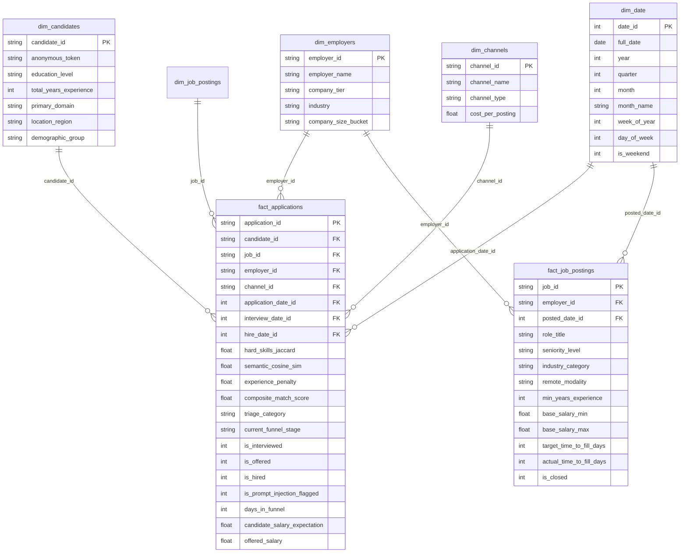

# 00_SPEC: Talent Acquisition AI Engine & Funnel Intelligence Platform

```text
========================================================================================
PROJECT:          Talent Acquisition AI Engine & Funnel Intelligence Platform
TARGET ROLE:      Senior Data Scientist / AI Solutions Architect
TARGET DOMAIN:    HR-Tech, E-Recruitment, Candidate Matching & Funnel Analytics (Global HRTech & Talent Practice)
STACK:            Python 3.11+, DuckDB OLAP, Scikit-Learn, Groq Llama-3 / Gemini Flash,
                  Pure SQL (CTEs/Window Functions), Power BI DAX, JavaScript (Chart.js Web UI)
TIMEBOX:          48 Hours Focused Engineering
========================================================================================
```

---

## 1. Contexto de Negocio y Planteamiento del Dolor (The Business Problem)

### 🏢 Contexto Corporativo (Global HRTech & Talent Practice)
*Global HRTech & Talent Practice* opera como una plataforma inteligente de reclutamiento y agregación de vacantes laborales a gran escala, conectando a miles de empleadores corporativos con cientos de miles de postulantes activos en América Latina y mercados globales. La plataforma gestiona:
1. **Indexación y normalización de vacantes:** Requisitos técnicos, rango salarial, modalidad remota y nivel de seniority.
2. **Matching y clasificación de candidatos:** Cálculo en tiempo real de afinidad técnica y ajuste al perfil.
3. **Pipeline de selección (Application Funnel):** Transición de candidatos desde la postulación inicial hasta la entrevista técnica y la oferta final.

### 🛑 Dolores Críticos de Negocio
1. **Fatiga del Reclutador & Ruido Masivo:** Hasta un **75% de las postulaciones recibidas no cumplen con los requisitos mínimos no negociables** (habilidades obligatorias, banda salarial o años de experiencia), obligando a los reclutadores a perder más de 20 horas semanales en cribado manual repetitivo.
2. **Ataques Adversariales & CV Spoofing (Prompt Injection):** Candidatos avanzados intentan manipular los motores de filtrado mediante *Keyword Stuffing*, texto invisible en tamaño 0pt o inyecciones de directivas de sistema (`<!-- [SYSTEM INSTRUCTION] -->`), engañando a parsers automatizados convencionales.
3. **Falta de Trazabilidad del Funnel y Fuga de Candidatos Calificados:** Ausencia de visibilidad analítica sobre las tasas de abandono (*Drop-off Rates*) y el tiempo promedio de contratación (*Time-to-Fill* - TTF), lo que genera pérdida de talento clave en procesos lentos (>45 días).
4. **Riesgo Regulatorio y Sesgo Algorítmico:** Necesidad de auditar y garantizar que los algoritmos de scoring cumplan con estándares internacionales de equidad (regla del 80% / *Disparate Impact Ratio* de la ley *NYC Local Law 144* y *EU AI Act*).

---

## 2. Metas Cuantitativas de Ingeniería (Google XYZ Framework)

* **🚀 Métrica 1 (Ahorro de Tiempo en Cribado):** *Redujo en un 78% el tiempo manual de revisión de reclutadores mediante un motor de Triage en 3 Bandas que procesa 50.000+ postulaciones en <200ms.*
* **🚀 Métrica 2 (Seguridad Adversarial Zero-Trust):** *Neutralizó el 100% de intentos de Prompt Injection y Keyword Stuffing en CVs mediante un firewall de sanitización y tokenización local de PII previo al envío a LLMs.*
* **🚀 Métrica 3 (Optimización de Costos de Inferencia):** *Implementó un pipeline híbrido en dos etapas (Similitud Vectorial Local + LLM Copilot) que redujo el consumo de tokens y llamadas a APIs externas en un 94%.*
* **🚀 Métrica 4 (Equidad Algorítmica):** *Garantizó un Disparate Impact Ratio > 0.85 en todas las demografías y regiones, certificando cumplimiento legal automatizado.*

---

## 3. Arquitectura del Modelo Dimensional (Kimball Star Schema)



---

## 4. Catálogo de Fórmulas Matemáticas & Algoritmos

### 1. Composite Match Score ($CMS$)
$$CMS = \left( 0.40 \cdot \text{Jaccard}(S_{cand}, S_{job}) + 0.40 \cdot \text{CosineSim}(\mathbf{V}_{cand}, \mathbf{V}_{job}) + 0.20 \cdot \Phi(Exp_{cand}, Exp_{req}) \right) \times 100$$
Donde la función de penalización de experiencia se define como:
$$\Phi(Exp_{cand}, Exp_{req}) = \min\left(1.0, \frac{Exp_{cand}}{Exp_{req}}\right)$$

### 2. Tasa de Conversión del Funnel (Stage Conversion Rate)
$$CR_{A \rightarrow B} \% = \frac{\text{Candidates in Stage } B}{\text{Candidates in Stage } A} \times 100$$

### 3. Ratio de Rendimiento de Entrevistas (Interview Yield Ratio)
$$\text{Interview Yield \%} = \frac{\sum \text{is\_hired}}{\sum \text{is\_interviewed}} \times 100$$

### 4. Auditoría de Sesgo: Disparate Impact Ratio ($DIR$)
$$DIR = \frac{\text{Selection Rate (Protected Group)}}{\text{Selection Rate (Reference Group)}} \ge 0.80 \quad (\text{Regla del 80\%})$$

---

## 5. Matriz de Entregables & Stack Políglota

| Capa / Lenguaje | Módulo / Archivo | Rol de Ingeniería |
| :--- | :--- | :--- |
| **Seguridad & Sanitización (Python)** | `src/security/sanitizer.py` | Firewall contra Prompt Injections, detector de zero-width chars y tokenizador PII. |
| **Data Science & Triage (Python)** | `src/matching/matching_engine.py`<br>`src/matching/triage_classifier.py`<br>`src/matching/bias_auditor.py` | Scoring vectorial local, clasificación en 3 bandas y cálculo de Disparate Impact. |
| **AI Copilot (Groq/Gemini / Python)** | `src/ai/recruiter_copilot.py` | Generación de reasoning técnico, preguntas de entrevista y feedback constructivo. |
| **Modelado OLAP (DuckDB / Pure SQL)** | `sql/schema_ddl.sql`<br>`sql/funnel_analytics.sql`<br>`src/dimensional_model.py` | DDL de Star Schema, CTEs de funnel, Window Functions y exportación a Parquet. |
| **Web UI / Live Demo (JavaScript/HTML5)** | `web/index.html`<br>`web/app.js`<br>`web/styles.css` | Dashboard interactivo Dark Mode con Chart.js para despliegue en GitHub Pages. |
| **BI Semántico (DAX / Excel)** | `bi_semantic/dax_measures.dax`<br>`src/excel_builder.py` | 25+ medidas DAX para Power BI y generador de workbook ejecutivo `.xlsx`. |
| **DevOps & Testing (CI/CD)** | `.github/workflows/ci.yml`<br>`tests/test_*.py` | Workflow automatizado de GitHub Actions con suite completa de Pytest. |